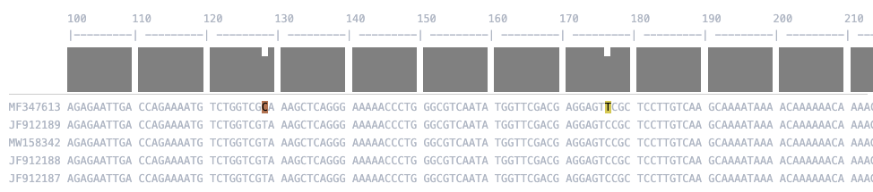

# Alignment Viewer

[](https://github.com/ECV-Lab-KULeuven/AlignmentViewer/actions/workflows/test.yml)

A quick and simple FASTA alignment viewer for Python notebooks with colored sequence visualization.

## Features

- Color-coded nucleotide display
- Support for both Jupyter notebooks and terminal output
- Configurable display options (number of sequences, columns, ruler, etc.)
- Scrollable alignment view in notebooks
- Block-based sequence formatting

## Installation

```bash
pip install git+https://github.com/ECV-Lab-KULeuven/AlignmentViewer.git
```


## Usage

### Terminal Output
```python
from AlignmentViewer import AlignmentViewer
AlignmentViewer.display_alignment("data/alignment.fasta", nseqs=5, ncols=50, as_html=False)
```

### Jupyter/HTML Output
```python
from AlignmentViewer import AlignmentViewer
from Bio import SeqIO
sequences = list(SeqIO.parse("../data/alignment.fasta", "fasta"))
AlignmentViewer.display_alignment(sequences, nseqs=5, ncols=50, as_html=True)
```


 An example of the available customisation:
```python
from AlignmentViewer import AlignmentViewer
AlignmentViewer.display_alignment("../data/alignment.fasta", nseqs=5, ncols=300, start_pos=100, as_html=True, show_consensus=True, color_snps_only=True)
```



## Configuration

You can customize the display using the following parameters:

- `nseqs`: Number of sequences to display (default: 0, 0 means all sequences)
- `ncols`: Number of columns to display (default: 0, 0 means all columns)
- `show_ruler`: Show position ruler (default: True)
- `show_consensus`: Show consensus bar chart (default: False)
- `consensus_height`: Height of consensus bar (default: "50px")
- `consensus_ignore_gaps`: Ignore gaps when calculating consensus (default: True)
- `block_size`: Size of sequence blocks (default: 10)
- `start_pos`: Starting position for display (default: 0)
- `container_height`: Height of the scrollable container in notebooks (default: "300px")
- `as_html`: Force HTML output (True) or terminal output (False), auto-detect if None (default: None)
- `color_snps_only`: Only color nucleotides that differ from consensus (default: False)


## License

MIT License
