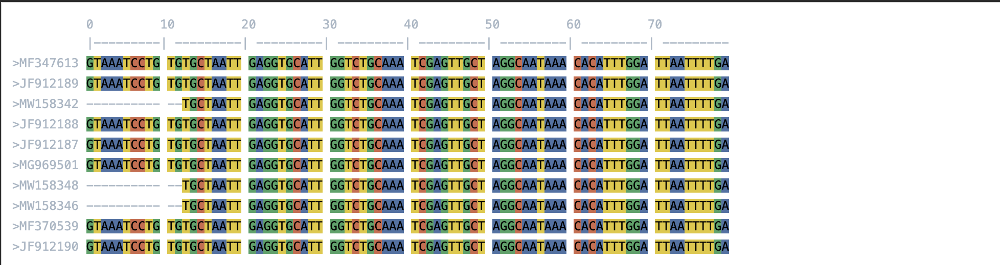

# Alignment Viewer

[](https://github.com/ECV-Lab-KULeuven/AlignmentViewer/actions/workflows/test.yml)

A quick and simple FASTA alignment viewer for Python notebooks with colored sequence visualization.

## Features

- Color-coded nucleotide display
- Support for both Jupyter notebooks and terminal output
- Configurable display options (number of sequences, columns, ruler, etc.)
- Scrollable alignment view in notebooks
- Block-based sequence formatting

## Installation

```bash
pip install git+https://github.com/ECV-Lab-KULeuven/AlignmentViewer.git
```


## Usage

### Terminal Output
```python
from AlignmentViewer import AlignmentViewer
AlignmentViewer.display_alignment("data/alignment.fasta", nseqs=5, ncols=50, as_html=False)
```

### Jupyter/HTML Output
```python
from AlignmentViewer import AlignmentViewer
AlignmentViewer.display_alignment("data/alignment.fasta", nseqs=5, ncols=50, as_html=True)
```

### Plotly Heatmap Output (Integrated)
```python
from AlignmentViewer import AlignmentViewer
from AlignmentViewer.config import DisplayConfig

# Simple plotly heatmap
AlignmentViewer.display_alignment("data/alignment.fasta", nseqs=5, ncols=50, as_plotly=True)

# With consensus bar
config = DisplayConfig(nseqs=5, ncols=50, as_plotly=True, show_consensus=True)
AlignmentViewer.display_alignment("data/alignment.fasta", config=config)
```

### Get Plotly Figure Object
```python
from AlignmentViewer import AlignmentViewer

# Get figure object for further customization
fig = AlignmentViewer.get_alignment_plotly("data/alignment.fasta", nseqs=5, ncols=50)
fig.show()

# Get as HTML string
html_string = AlignmentViewer.get_alignment_plotly_html("data/alignment.fasta", nseqs=5, ncols=50)
```

### Using the Config Object
You can customize display options using the `DisplayConfig` object:
```python
from AlignmentViewer.config import DisplayConfig
config = DisplayConfig(
    nseqs=5,
    ncols=50,
    show_ruler=True,
    block_size=10,
    as_plotly=True,  # Enable Plotly output
    show_consensus=True  # Add consensus bar above heatmap
)
AlignmentViewer.display_alignment("data/alignment.fasta", config=config)
```



## Configuration

You can customize the display using the following parameters:

- `nseqs`: Number of sequences to display (default: 10)
- `ncols`: Number of columns to display (default: 100)
- `show_ruler`: Show position ruler (default: True)
- `block_size`: Size of sequence blocks (default: 10)
- `start_pos`: Starting position for display (default: 0)
- `container_height`: Height of the scrollable container in notebooks (default: "300px")
- `as_html`: Return HTML string instead of displaying in notebook (default: check)


## License

MIT License
